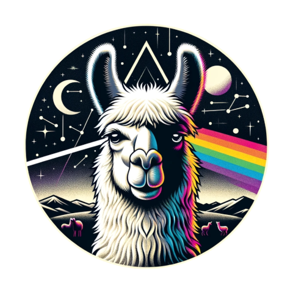

# [Urcuchillay](http://urcuchillay.ai)

"Ur-koo-CHEE-lye"

A drop-in OpenAI API replacement bundling a local LLM with acceleration for Apple and NVIDIA GPUs.



In the Incan religion, Urcuchillay was depicted as a multicolored male llama, worshipped by Incan herders for his role in protecting and increasing the size of their herds.

## Features

- OpenAI API
- Local LLM
- GPU acceleration
  - Apple Metal
  - NVIDIA CUDA
- Open Source
  - [MIT license](LICENSE)
- Python modules
  - [llama-cpp-python](https://github.com/abetlen/llama-cpp-python)
  - [LlamaIndex](https://www.llamaindex.ai)

## Prerequisites

### macOS

- [Homebrew](https://brew.sh) is used to install software dependencies.

### Linux

- For NVIDIA GPU acceleration, please [install CUDA drivers](https://developer.nvidia.com/cuda-downloads?target_os=Linux).

## Installation

Creates a virtual Python environment ([pyenv](https://github.com/pyenv/pyenv)) with all dependency modules prepared for use.
This script is suitable for both macOS and Linux (tested with [Ubuntu 22.04 LTS](http://releases.ubuntu.com/22.04/) and [Fedora 39](https://fedoraproject.org/workstation/download/)).
```
sh setup.sh
```

Alternatively, Urcuchillay can be installed directly via curl:
```
curl -L setup.urcuchillay.ai | sh
```

## Manual Installation
*Note*: Automated installation via ```setup.sh``` is recommended.

For manual installation instructions, see the [Manual Installation Guide](docs/manual-installation.md).

## Models
Models are automatically downloaded and cached locally if not already present.

A folder called "models" will be created in the current directory if it does not already exist.

By default, Urcuchillay supports alias names for the following models (by using the ```--model``` argument):
- small: (7B) [TheBloke/Llama-2-7B-Chat-GGUF](https://huggingface.co/TheBloke/Llama-2-7B-Chat-GGUF)*
- medium: (13B) [TheBloke/Llama-2-13B-Chat-GGUF](https://huggingface.co/TheBloke/Llama-2-13B-Chat-GGUF)*
- large: (70B) [TheBloke/Llama-2-70B-Chat-GGUF](https://huggingface.co/TheBloke/Llama-2-70B-Chat-GGUF)*
- mistral: (7B) [TheBloke/Mistral-7B-v0.1-GGUF](https://huggingface.co/TheBloke/Mistral-7B-v0.1-GGUF)
- mixtral: (8x7B) [TheBloke/Mixtral-8x7B-Instruct-v0.1-GGUF](https://huggingface.co/TheBloke/Mixtral-8x7B-Instruct-v0.1-GGUF)

Alternative models can be specified using the ```--model_url``` argument.

**Note*: Use of this model is governed by the Meta license. Please [visit the website and accept the license](https://ai.meta.com/resources/models-and-libraries/llama-downloads/) before using this models with Urcuchillay.

## Data
Urcuchillay uses [LlamaIndex](https://www.llamaindex.ai) for data ingesting and indexing.

[Supported file types](https://docs.llamaindex.ai/en/stable/module_guides/loading/simpledirectoryreader.html#supported-file-types):
- .csv - comma-separated values
- .docx - Microsoft Word
- .epub - EPUB ebook format
- .hwp - Hangul Word Processor
- .ipynb - Jupyter Notebook
- .jpeg, .jpg - JPEG image
- .mbox - MBOX email archive
- .md - Markdown
- .mp3, .mp4 - audio and video
- .pdf - Portable Document Format
- .png - Portable Network Graphics
- .ppt, .pptm, .pptx - Microsoft PowerPoint

## Storage
The result of data files which have been indexed into a vector store can optionally be saved in a local directory using the ```--save``` argument.

Files will be stored in a directory called "storage" by default. The "storage" directory will be created if it does not already exist.

The indexed vector store can be retrieved instead of being regenerated by using the ```--load``` argument.

## Usage
```
usage: query.py [-h] [--debug [DEBUG]] [-p PROMPT] [--cpu] [--temperature TEMPERATURE]
                [--max_new_tokens MAX_NEW_TOKENS] [--context CONTEXT] [--save [SAVE]]
                [--load [LOAD]] [--data DATA] [--path PATH] [--storage STORAGE]
                [--model_url MODEL_URL] [--model MODEL]
                [--embed_model_name EMBED_MODEL_NAME]
                [--embed_model_provider EMBED_MODEL_PROVIDER]
                [--pretrained_model_name PRETRAINED_MODEL_NAME]
                [--pretrained_model_provider PRETRAINED_MODEL_PROVIDER]

Process command parameters

options:
  -h, --help            show this help message and exit
  --debug [DEBUG]       Enable debug mode (default: False)
  -p PROMPT, --prompt PROMPT
                        The prompt to process (default: What is Urcuchillay?)
  --cpu                 Use the CPU only instead of GPU acceleration
  --temperature TEMPERATURE
                        The temperature value for the model (default: 0.1)
  --max_new_tokens MAX_NEW_TOKENS
                        The max new tokens value for the model (default: 256)
  --context CONTEXT, --context_window CONTEXT
                        The context window value for the model (default: 3900)
  --save [SAVE]         Save indexed vector store locally (default: False)
  --load [LOAD]         Load indexed vector store (default: False)
  --data DATA, --data_path DATA
                        The path to data files to be indexed (default: ./data)
  --path PATH, --model_path PATH
                        The path to the directory for cached models (default: ./models)
  --storage STORAGE, --storage_path STORAGE
                        The path to save and load the vector store (default: ./storage)
  --model_url MODEL_URL
                        Custom URL for model (defaults to the Llama-2-7b model)
  --model MODEL, --model_name MODEL
                        The name of the model to use (default: extracted from model url)
  --embed_model_name EMBED_MODEL_NAME
                        The name of the embedding model to use (default: local)
  --embed_model_provider EMBED_MODEL_PROVIDER
                        The provider of the embedding model to use (default: None)
  --pretrained_model_name PRETRAINED_MODEL_NAME
                        The name of the pretrained model to use (default: None)
  --pretrained_model_provider PRETRAINED_MODEL_PROVIDER
                        The provider of the pretrained model to use (default: None)
```

## Examples

### Simple query
- The default "small" (7B) model will be downloaded if not already available.
- All files located in the "data" directory will be processed.
```
% ./query.py --prompt "Is Urcuchillay a llama?"
Query: Is Urcuchillay a llama?

Response: Based on the information provided in the context, Urcuchillay is not a llama. According to the information, Urcuchillay was a god worshiped by the Incas, believed to be a multicolored male llama who watched over animals. However, the information does not suggest that Urcuchillay is a real llama or a specific type of animal, but rather a deity with certain attributes associated with llamas.
```

### Save indexed vector store locally
- Data files will be processed and the results will be saved to the "storage" directory.
```
% ./query.py --save
```

### Load an indexed vector store 
- Vector store will be loaded from the default local storage location instead of generated from data path.
```
% ./query.py --load
```

### Use the Mistral 7B model from a download URL
- Model will be downloaded if not already cached locally
```
% ./query.py --model_url https://huggingface.co/TheBloke/Mistral-7B-v0.1-GGUF/resolve/main/mistral-7b-v0.1.Q4_K_M.gguf
```

### Use the Mixtral 8x7B model with debug output enabled
- default path of "./models" will be used
- a custom path to cached modules can optionally be specified with the ```--model_path``` argument
```
% ./query.py --model mixtral --debug"
```
