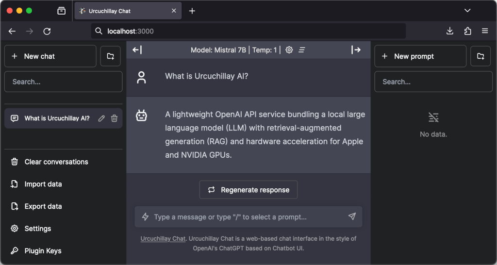

# [Urcuchillay](http://urcuchillay.ai)

"Ur-koo-CHEE-lye"

A lightweight [OpenAI API](https://platform.openai.com/docs/api-reference)-compatible service bundling a local [LLM](https://en.wikipedia.org/wiki/Large_language_model) with [RAG](https://en.wikipedia.org/wiki/Retrieval-augmented_generation#Retrieval-augmented_generation) and hardware acceleration for Apple and NVIDIA GPUs.

<div style="text-align:center;">
  
</div>

In the Incan religion, Urcuchillay was depicted as a multicolored male llama, worshipped by Incan herders for his role in protecting and increasing the size of their herds.

## Features



- [OpenAI API](https://platform.openai.com/docs/api-reference) support
- Local large language models ([LLMs](https://en.wikipedia.org/wiki/Large_language_model))
- Retrieval-augmented generation ([RAG](https://en.wikipedia.org/wiki/Retrieval-augmented_generation#Retrieval-augmented_generation))
- Web-based chat interface in the style of ChatGPT via [Chatbot UI](https://github.com/mckaywrigley/chatbot-ui)
- GPU acceleration
  - Apple Metal
  - NVIDIA CUDA
- Open Source
  - [MIT license](LICENSE)
- Python modules
  - [llama-cpp-python](https://github.com/abetlen/llama-cpp-python)
  - [LlamaIndex](https://www.llamaindex.ai)

## Quickstart Guide
### Linux with CUDA using NVIDIA Container Toolkit
1. Launch Docker Compose via script (please set at least one GPU layer for acceleration):
- **Note**: Files placed in the ```data``` directory will be used to create the RAG vector store.
```shell
git clone https://github.com/castellotti/urcuchillay.git
cd urcuchillay
./scripts/docker-compose.sh --n-gpu-layers 30
```
2. Open Web Chat UI in a browser:
- [http://localhost:3000](http://localhost:3000)

### macOS
- **Note** The LLM [server](#server) and RAG [index](#index) applications must run natively on macOS in order to access the GPU through [Metal](https://developer.apple.com/metal/). It not currently possible to access Metal from inside a Docker container. 
1. Install Urcuchillay: 
```shell
curl -L setup.urcuchillay.ai | sh
```
2. Open new Terminal, activate environment, and start [server](#server) on the network:
```shell
pyenv activate urcuchillay-env && cd urcuchillay ; ./server.py --host 0.0.0.0
```
3. Open new Terminal, activate environment, and run [index](#index) to create the RAG vector store from files in the ```data``` directory:
```shell
pyenv activate urcuchillay-env && cd urcuchillay ; ./index.py
```
4. Start Gateway and Web Chat UI via [Docker](https://docs.docker.com/get-docker/):
```shell
./scripts/docker-compose.sh --load
```
5. Open Web Chat UI in a browser:
- [http://localhost:3000](http://localhost:3000)

# Table of Contents
- [Urcuchillay](#urcuchillay)
  - [Features](#features)
  - [Quickstart Guide](#quickstart-guide)
- [Table of Contents](#table-of-contents)
  - [Software](#software)
  - [Prerequisites](#prerequisites)
    - [macOS](#macos)
    - [Linux](#linux)
  - [Installation](#installation)
    - [Manual Installation](#manual-installation)
  - [Models](#models)
  - [Data](#data)
  - [Storage](#storage)
  - [Usage](#usage)
    - [Server](#server)
    - [Index](#index)
    - [Gateway](#gateway)
  - [Web Chat User Interface](#web-chat-user-interface)
- [Testing](#testing)
  - [Endpoints](#endpoints)

## Software
- [gateway.py](gateway.py): The core API service, merging a local LLM with RAG functionality via [LlamaIndex](https://www.llamaindex.ai) while conforming to OpenAI API [chat](https://platform.openai.com/docs/api-reference/chat) and [text-completion](https://platform.openai.com/docs/api-reference/completions) endpoints. All other endpoints are proxied through without modification to the local LLM server.
- [server.py](server.py): An embedded [Llama.cpp](https://github.com/ggerganov/llama.cpp/) service with [Python bindings](https://github.com/abetlen/llama-cpp-python) providing [OpenAI API](https://platform.openai.com/docs/api-reference)-compatible access to your local LLM.
- [index.py](index.py): A command-line tool to create and manage the vector store for retrieval-augmented generation (RAG).
- [prompt.py](prompt.py): A command-line tool for simple single queries to test the LLM and RAG storage.
- [config.json](config.json): This file overrides [default configuration settings](config.py) in a simple JSON format.

## Prerequisites

### macOS

- [Homebrew](https://brew.sh) is used to install software dependencies.
- [Docker](https://docs.docker.com/get-docker/) is recommended for the interactive chat web interface.

### Linux

- For NVIDIA GPU acceleration, please [install CUDA drivers](https://developer.nvidia.com/cuda-downloads?target_os=Linux).
- [NVIDIA Container Toolkit](https://docs.nvidia.com/datacenter/cloud-native/container-toolkit/latest/install-guide.html) is necessary for [Docker](https://docs.docker.com/get-docker/) with GPU acceleration.

## Installation

The setup script creates a virtual Python environment ([pyenv](https://github.com/pyenv/pyenv)) with all dependency modules prepared for use.
This script is suitable for both macOS and Linux (tested with [Ubuntu 22.04 LTS](http://releases.ubuntu.com/22.04/) and [Fedora 39](https://fedoraproject.org/workstation/download/)).
```shell
sh setup.sh
```

Alternatively, Urcuchillay can be installed directly via curl:
- Open the *Terminal* application and paste the following:
```shell
curl -L setup.urcuchillay.ai | sh
```

### Manual Installation
*Note*: Automated installation via ```setup.sh``` is recommended.

For manual installation instructions, see the [Manual Installation Guide](docs/manual-installation.md).

## Models
Models are automatically downloaded and cached locally if not already present.

A folder called ```models``` will be created in the current directory if it does not already exist.

By default, Urcuchillay supports alias names for the following models (by using the ```--model``` argument):
- mistral: (7B) [TheBloke/Mistral-7B-v0.1-GGUF](https://huggingface.co/TheBloke/Mistral-7B-v0.1-GGUF)
- mixtral: (8x7B) [TheBloke/Mixtral-8x7B-Instruct-v0.1-GGUF](https://huggingface.co/TheBloke/Mixtral-8x7B-Instruct-v0.1-GGUF)
- small: (7B) [TheBloke/Llama-2-7B-Chat-GGUF](https://huggingface.co/TheBloke/Llama-2-7B-Chat-GGUF)*
- medium: (13B) [TheBloke/Llama-2-13B-Chat-GGUF](https://huggingface.co/TheBloke/Llama-2-13B-Chat-GGUF)*
- large: (70B) [TheBloke/Llama-2-70B-Chat-GGUF](https://huggingface.co/TheBloke/Llama-2-70B-Chat-GGUF)*

Alternative models can be specified using the ```--model_url``` argument.

***Note**: Use of indicated models are governed by the Meta license. Please [visit the website and accept the license](https://ai.meta.com/resources/models-and-libraries/llama-downloads/) before using these models with Urcuchillay.

## Data
Urcuchillay uses [LlamaIndex](https://www.llamaindex.ai) for data ingesting and indexing.

[Supported file types](https://docs.llamaindex.ai/en/stable/module_guides/loading/simpledirectoryreader.html#supported-file-types):
- .csv - comma-separated values
- .docx - Microsoft Word
- .epub - EPUB ebook format
- .hwp - Hangul Word Processor
- .ipynb - Jupyter Notebook
- .jpeg, .jpg - JPEG image
- .mbox - MBOX email archive
- .md - Markdown
- .mp3, .mp4 - audio and video
- .pdf - Portable Document Format
- .png - Portable Network Graphics
- .ppt, .pptm, .pptx - Microsoft PowerPoint

## Storage
The result of data files which have been indexed into a vector store can be saved to a local directory.

Files will be stored in a directory called ```storage``` by default.

The ```storage``` directory will be created if it does not already exist.

## Usage

***Note***: Typically after install via ```setup.sh``` it is necessary to activate the pyenv virtual environment for urcuchillay in a new terminal before use:
```shell
pyenv activate urcuchillay-env
```

### Server
- First the ```server.py``` service should be started:
```shell
./server.py
```
- If a model file is not found a download for the default model will automatically begin:
```shell
WARNING:server:Model not found. Downloading from URL.
Downloading url https://huggingface.co/TheBloke/Mistral-7B-Instruct-v0.1-GGUF/resolve/main/mistral-7b-instruct-v0.1.Q4_K_M.gguf to path models/mistral-7b-instruct-v0.1.Q4_K_M.gguf
total size (MB): 4368.44
  4%|█▋                                      | 181/4166 [00:04<01:43, 38.47it/s]
```

- Once initialized the service will begin accepting requests (on **localhost** port **8000** by default):
```shell
INFO:     Started server process [#]
INFO:     Waiting for application startup.
INFO:     Application startup complete.
INFO:     Uvicorn running on http://127.0.0.1:8000 (Press CTRL+C to quit)
```
- A custom host and port can be specified via ```--api_host``` and ```--api_port``` arguments respectively.
- For additional options please check usage:
```shell
./server.py --help
```

### Index
- To generate and save a local vector store for RAG support, the ```index.py``` command-line tool is available.
- By default files in the ```data``` directory will be processed and the local vector store will be placed in a directory called ```storage```. These locations can be set using the ```--data``` and ```--storage``` arguments respectively.
- The following command will delete any existing local vector store and create a new one from files found in the ```data``` directory:
```shell
./index.py --reset
```
- For additional options please check usage:
```shell
./index.py --help
```

### Gateway
- The ```gateway.py``` service operates similarly to the ```server.py``` process but will include RAG support via LlamaIndex for any calls to the [chat](https://platform.openai.com/docs/api-reference/chat) or [text-completion](https://platform.openai.com/docs/api-reference/completions) endpoints.
- The service will scan files in the ```data``` directory at startup and create a vector store for RAG support.
- By default ```gateway.py``` will listen on **localhost** port **8080** and will communicate with ```server.py``` on port **8000**.
- The host and port for the ```gateway.py``` service can be set using the ```--gateway_host``` and ```--gateway_port``` arguments.
```shell
./gateway.py
INFO:     Started server process [#]
INFO:     Waiting for application startup.
INFO:     Application startup complete.
INFO:     Uvicorn running on http://127.0.0.1:8080 (Press CTRL+C to quit)
```
- To save startup time, the ```index.py``` command can be used to create and save the vector store locally, and ```gateway.py``` can access this local cache using the ```--load``` argument:
```shell
./gateway.py --load
```
- To host the service on the network for access via web chat user interface within a Docker container:
```shell
./gateway.py --gateway_host 0.0.0.0
```
- For additional options please check usage:
```shell
./gateway.py --help
```

## Web Chat User Interface


A web-based user interface in the style of ChatGPT is available via [Chatbot UI](https://github.com/mckaywrigley/chatbot-ui).

Installation instructions are available through the [Chatbot UI GitHub repository](https://github.com/mckaywrigley/chatbot-ui#chatbot-ui), or if [Docker](https://docs.docker.com/get-docker/) is available the interface can be started immediately on http://localhost:3000 once the ```server.py``` and ```gateway.py``` services are running:
```shell
./scripts/docker-chat-web.sh
```

# Testing
Test scripts and other utilities can be found in the [scripts](scripts) directory.

## Endpoints
- For examples and instructions, please see [Testing Endpoints](docs/testing-endpoints.md).

## Unit tests
- Unit tests can be run from the main directory from within the virtual python environment:
```shell
pyenv activate urcuchillay-env
python -m unittest discover tests
```
